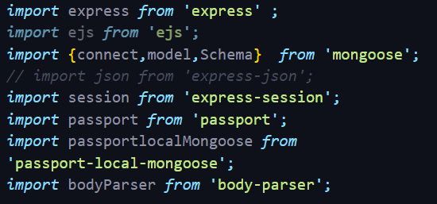
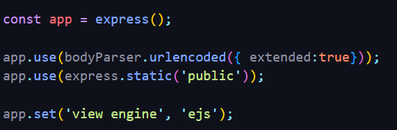
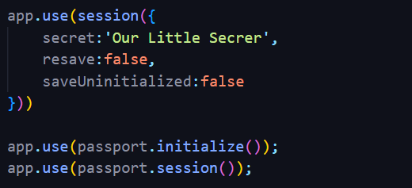
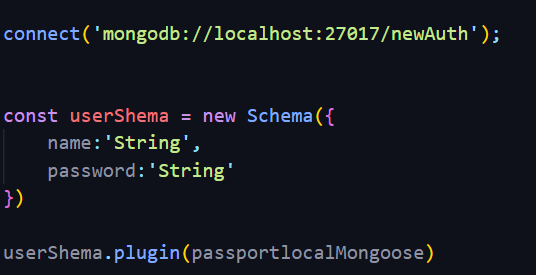
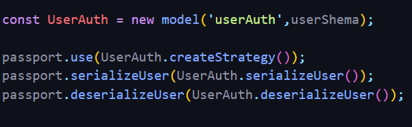

#Authentication Using Passport js creating sessions:

<h5>Step1:</h5>
Installing the packages:

<h5>Step2:</h5>
Setting up  the packages for express server:

Now the order of setting up the passportjs is important we need to follow the same exact order:

No-1:
setup session, passport initization and passort handle session

No-2:
Connecting to the Database:
Creating Scehema:
plugin  schema with passport-local-mongoose

No-4:
creating Model:
passport.createStrategy();
serilize and deserialize the user models;

